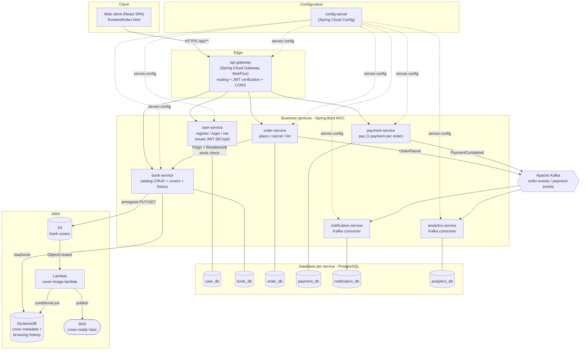
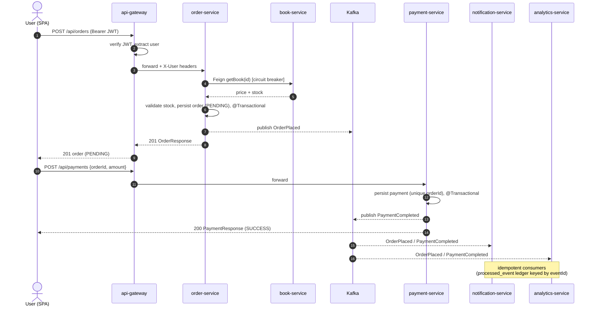
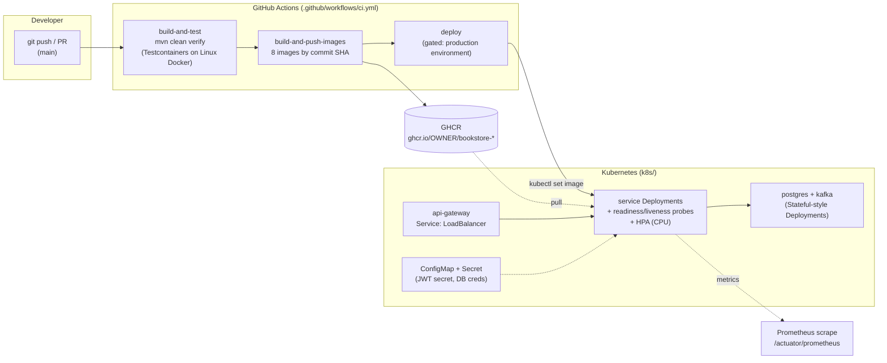

# Architecture — Full Picture

The one-page view of the whole system: client, edge, services, data, messaging, cloud, and the
delivery pipeline. Design rationale lives in [`02-DESIGN.md`](02-DESIGN.md); the phase-by-phase
evolution is in [`01-ROADMAP.md`](01-ROADMAP.md) and the git tags `phase-0 … phase-11`.

## System overview

**Reading it:** the SPA only ever calls the gateway. The gateway verifies the JWT (shared secret,
never issues) and routes to the four public services. `order-service` calls `book-service`
synchronously (Feign, wrapped in a Resilience4j circuit breaker) for the stock check, and emits an
`OrderPlaced` event; `payment-service` emits `PaymentCompleted`. Two independent consumer groups
(`notification`, `analytics`) react to those events — the write path never blocks on them. Covers are
an async AWS pipeline: the service hands out a presigned S3 URL, and an S3 `ObjectCreated` event
triggers a Lambda that writes cover metadata to DynamoDB and publishes to SNS.

## Order → payment: the core flow

Consumers are **idempotent**: each records handled `eventId`s in a `processed_event` table and skips
duplicates, so Kafka's at-least-once delivery is safe to re-deliver.

## Runtime & delivery

A failing test makes `build-and-test` red and **blocks** image build and deploy. Images are tagged by
commit SHA (immutable, traceable); `deploy` is gated behind a protected `production` environment for
manual approval. Every service exposes Micrometer metrics at `/actuator/prometheus`
(see [`MONITORING.md`](MONITORING.md)).

## Key invariants

| Concern | How it's enforced |
|---|---|
| No cross-service DB coupling | Database per service; `orders.user_id`, `order_item.book_id` are bare ids (no FK across services) |
| Edge auth | Gateway verifies JWT; services trust forwarded identity; secret via env/config, never committed |
| Order correctness | `@Transactional` place-order; stock checked via Feign; `book-service` uses optimistic locking (`@Version`) |
| One payment per order | Unique constraint on `payment.order_id` |
| Resilience | Resilience4j circuit breaker on `order → book`; graceful degradation when book-service is down |
| Event safety | At-least-once Kafka + idempotent consumers (`processed_event` ledger keyed by `eventId`) |
| Cloud idempotency | Lambda conditional `PutItem` (`attribute_not_exists(bookId)`) |
| Schema management | Flyway migrations only; `ddl-auto=validate` |
